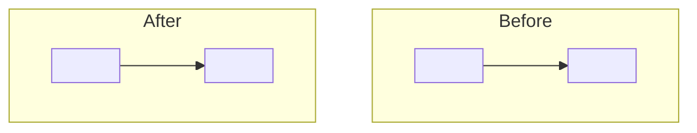

# ADR Template

**Output path**: `docs/design/YYYYMMDD-<decision-name>-adr.md`

**Rooted in**: Michael Nygard's original ADR format (2011), MADR v4 (Markdown
Any Decision Records), and practices from Spotify, ThoughtWorks, and GitHub.

## Template

````markdown
# YYYYMMDD-<Decision-Name>-ADR

**Status**: <Proposed | Accepted | Rejected | Deprecated | Superseded by
[ADR-NNNN](link)> **Date**: YYYY-MM-DD **Deciders**:
<Names of people involved in the decision>

## Decision Drivers

<!-- Bulleted list of the specific forces, requirements, and constraints that
     shaped this decision. More structured than prose context — helps future
     readers understand what was non-negotiable vs. flexible. -->

- <Driver 1 — e.g., "Must support horizontal scaling">
- <Driver 2 — e.g., "Team has no experience with technology X">
- <Driver 3 — e.g., "Must integrate with existing Y system">

## Context

<Description of the problem or question that prompted this decision. Include the
specific situation, constraints, and why a decision was needed now. Write for a
future reader who was not in the room.>

## Decision

**We will <bold summary of the decision in active voice — "We will use X because
Y">.**

### Implementation Details

(Code snippets, configuration, or architecture showing how the decision is
implemented. Keep brief — link to a technical doc for full detail.)

### Architecture Diagram

<!-- Include when the decision changes component relationships or data flow.
     Omit for decisions that do not alter architecture. -->



## Consequences

<!-- State consequences neutrally — what becomes easier AND harder. Honest
     negatives are the most valuable part. -->

### Positive

1. <What becomes easier or better>
2. <What becomes easier or better>

### Negative

1. <What becomes harder or worse>
2. <What becomes harder or worse>

### Mitigations

- <How to address the negatives>

## Alternatives Considered

<!-- Required. At minimum one alternative. Use MADR's "Good because / Bad
     because" format for quick scanning. -->

### Alternative 1: <Name>

- Good, because <benefit>
- Good, because <benefit>
- Bad, because <drawback>
- Bad, because <drawback>

**Why not**: <Concise reason for rejection>

### Alternative 2: <Name>

...

## Validation

<!-- Optional. How will you know this decision was right? What would make you
     revisit it? -->

- <Signal that confirms the decision was correct>
- <Signal that would trigger reconsideration>

## Links

<!-- Related ADRs, RFCs, issues, or external references. Always link superseded
     and related ADRs bidirectionally. -->

- Supersedes: <ADR link, if applicable>
- Related: <ADR or RFC links>
- References: <External resources>

---

**Last Updated**: YYYY-MM-DD
````

## Guidelines

### Core Principles (from Nygard)

- **One decision per ADR**: Don't bundle multiple decisions. If you are making
  two distinct choices, write two ADRs
- **Immutable once accepted**: Never edit an accepted ADR. If a decision
  changes, write a new ADR that supersedes the old one. This preserves the
  historical record
- **Store with the code**: ADRs belong in the repository they affect, not in a
  separate wiki where they will rot

### Structure (from MADR)

- **Decision Drivers section**: Separate from Context. Drivers are the specific
  forces; Context is the narrative. Drivers make it easy to evaluate whether the
  decision still applies when forces change
- **Alternatives are required**: Always document at least one alternative with
  pro/con analysis. This is the single highest-value addition to Nygard's
  original format — it shows the decision space was explored
- **"Good because / Bad because" format**: Faster to scan than prose pros/cons
  lists

### Status Lifecycle

```
Proposed → Accepted → [Superseded by ADR-NNNN | Deprecated]
                  ↘ Rejected
```

- **Proposed**: Decision is under review (use when ADRs go through PR review)
- **Accepted**: Decision is finalized and in effect
- **Rejected**: Decision was considered but not adopted — still valuable to
  prevent re-proposing the same idea
- **Deprecated**: Decision is no longer relevant (context has changed)
- **Superseded**: A newer ADR replaces this one. Update BOTH ADRs with links

### When to Write an ADR

Only record decisions that are **architecturally significant**: costly to
change, affect multiple components, or involve meaningful trade-offs. Not every
technical choice needs an ADR. A good heuristic: if someone would reasonably ask
"why did we do it this way?", write an ADR.

### ADR vs. RFC

- An **RFC** is a proposal process (written before the decision, designed for
  discussion)
- An **ADR** is a decision record (written at or after decision time, designed
  for future reference)
- For decisions that need broad input, use an RFC process, then distill the
  outcome into an ADR. ~80% of decisions only need an ADR

### Anti-Patterns

- **Too verbose**: Keep to 1-2 pages. If longer, the decision needs splitting or
  an RFC is more appropriate
- **Missing the "why"**: Recording what was decided without the forces and
  reasoning. The Context and Decision Drivers are the most important sections
- **No date**: Without dates, future readers cannot assess temporal context
- **Editing accepted ADRs**: Destroys the historical record. Supersede instead
- **ADR-ing everything**: Reserve for significant decisions. Trivial choices
  documented as ADRs create noise
