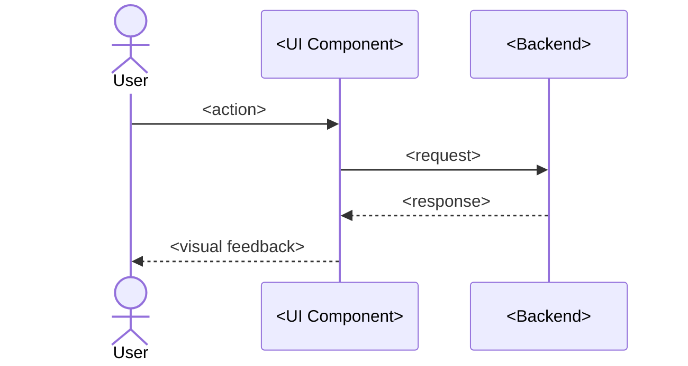

# Guide Template

**Output path**: `docs/guides/<feature>.md`

**Informed by**: Diataxis framework (how-to guide mode), Microsoft Writing Style
Guide, Google Developer Documentation Style Guide, progressive disclosure
principles, Stripe/Twilio/Vercel documentation patterns.

## Template

````markdown
# <Feature Name>

## What This Is

<!-- Plain language. No jargon. First paragraph answers "what does this do
     and why would I use it?" A reader who stops here should know if this
     guide is relevant to them. -->

<Plain language explanation of the feature — what it does and why you'd use it.>

## Prerequisites

Before you start, make sure you have:

- <What users need before starting>
- <Any accounts, permissions, or setup required>

## Quick Start

<!-- The fastest path to a working result. 3-5 steps max.
     A user should be able to get the feature working by following only
     this section. Detailed how-tos come after. -->

1. <First step — one action, starts with a verb>
2. <Second step>
3. <Third step>

## How to Use It

<!-- Task-oriented sections. Each heading is "How to <verb> <noun>".
     Organize by what users want to accomplish, not by system internals. -->

### How to <Common Task 1>

1. <Step — one action per step, starts with a verb>
2. <Step>
3. <Step>

**Example**: <Concrete example with real text the user would type or see>

### How to <Common Task 2>

1. <Step>
2. <Step>

### How to <Common Task 3>

...

## Visual Walkthrough

<!-- At least one screenshot or user-flow diagram per guide.
     Screenshots confirm — they don't instruct. Crop tight, annotate
     the focal point, write descriptive alt text. -->



<Caption explaining what the diagram shows.>

## Common Questions

### <Question users would ask?>

<Answer in plain language.>

### <Another common question?>

<Answer.>

## Troubleshooting

<!-- Organize by SYMPTOM (what the user sees), not by cause.
     Users search for what they observe. Put the fix BEFORE the explanation. -->

### <Exact error message or symptom>

**Fix**:

1. <Step>
2. <Step>

**Why it happens**: <Plain language explanation>

### <Another symptom>

**Fix**:

1. <Step>

**Why it happens**: <Explanation>

## Tips and Best Practices

- **<Tip>**: <Practical advice>
- **<Tip>**: <Practical advice>

## What's Next

- [<Related Guide>](./related-feature.md) — <One-line description>

## Technical Details

For developers who want to understand how this works under the hood:

- [<Feature PRD>](../design/<feature>-prd.md)
- [<Technical Deep-Dive>](../technical/<feature>.md)

---

**Last Updated**: YYYY-MM-DD
````

## Guidelines

### Document Type (Diataxis)

A guide is a **how-to document** — it's task-oriented, assumes the user has a
goal, and shows them how to accomplish it. It is NOT a tutorial (which teaches
by doing) or reference (which lists facts). Keep these modes separate.

### Voice and Language

- **Second person, active voice, present tense**: "You click the button" not
  "The button should be clicked."
- **One step = one action**: Never combine two actions in a single numbered
  step.
- **Ban "just," "simply," and "easy"**: These minimize user frustration and
  create a condescending tone when the user is stuck.
- **Front-load every section**: First sentence answers "what do I do?" Details,
  context, and rationale come after (inverted pyramid).
- **Define jargon on first use**: Or link to a glossary. Never assume technical
  vocabulary.
- **Grade level 8 readability**: Short sentences (under 25 words average), short
  paragraphs (3-5 sentences max), bulleted lists over dense prose.

### Structure

- **Quick Start section**: The fastest path to a working result. A user should
  be able to get the feature working by following only this section.
- **Task-oriented headings**: "How to <verb> <noun>", not system component
  names. Organize by what users want to accomplish.
- **Progressive disclosure**: Show the common path by default. Put advanced
  options, caveats, and edge cases in secondary sections or collapsible blocks.
  Never force a beginner to wade through expert detail.

### Troubleshooting

- **Organize by symptom, not cause**: Use the exact error message text as the
  heading. Users search for what they observe, not internal failure modes.
- **Fix before explanation**: Put the solution first, then explain why it
  happened. The user wants to unblock themselves.
- **At least 2-3 problems**: Every guide needs troubleshooting content.

### Visual Aids

- **Screenshots confirm, they don't instruct**: The instruction goes in the
  text. The screenshot shows "you should see this" confirmation.
- **Crop tight**: Show only the relevant part of the UI. Full-screen screenshots
  add noise.
- **Annotate the focal point**: Use callouts or highlights to direct attention
  to the specific element referenced in the text.
- **Alt text describes what to notice**: Not "screenshot" but "The Settings page
  showing the API key field highlighted in the sidebar."
- **Use sparingly**: Not every step needs a screenshot. Use them at decision
  points, complex UI, or where the user is likely to get lost.

### Anti-Patterns

- **Mixing tutorials and how-to guides**: Tutorials say "follow me" (learning).
  How-to guides say "here's how to solve X" (working). Don't conflate them.
- **Organizing by system internals**: Users don't know your module structure.
  They know what they want to do.
- **Stale screenshots**: Worse than no screenshots. Establish a review cadence.
  Use code-generated diagrams (Mermaid) where possible.
- **Over-screenshotting**: Creates maintenance burden and slows page load. One
  screenshot per key step or decision point.
