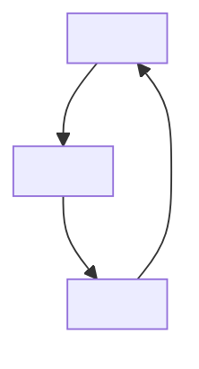
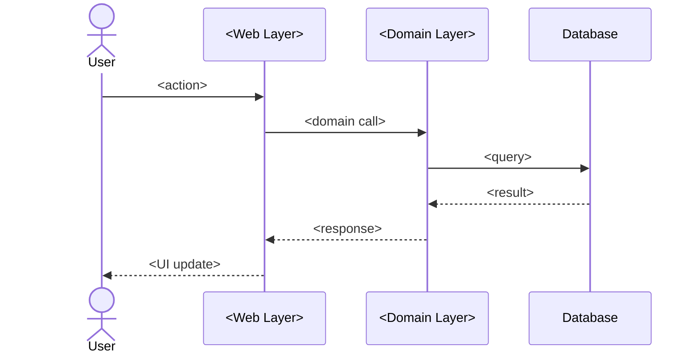

# Plan Template

**Output path**: `docs/plans/<feature>-plan.md`

**Informed by**: Google design doc practices, Stripe's incremental delivery
model, PERT estimation, FMEA risk assessment, Rust RFC "guide-level explanation"
pattern.

## Template

````markdown
# <Feature Name> Implementation Plan

**Metadata:**

- Type: plan
- Status: active
- Created: YYYY-MM-DD
- Topic: <feature-slug>
- PRD: [link](../design/<feature>-prd.md)

## Executive Summary

- **Feature**: <One-line description>
- **Complexity**: <Low|Medium|High>
- **Approach**: <Brief strategy description>
- **Key integration points**: <What existing systems this touches>
- **Dependencies**: <External libraries or features required>

## Non-Goals / Out of Scope

<!-- Inherited from PRD but narrowed for implementation. What this plan
     explicitly will NOT address. -->

- <What is deliberately excluded from this implementation>

## Open Questions

<!-- Known unknowns that must be resolved before or during implementation.
     Per-phase questions go in the phase section. -->

| Question   | Owner  | Must resolve before | Resolution                |
| ---------- | ------ | ------------------- | ------------------------- |
| <Question> | <Name> | Phase N             | <Pending / Answered: ...> |

## Feature Specification

### User Stories and Acceptance Criteria

**Story 1: <Title>**

- **AC1**: <Acceptance criterion>
- **AC2**: <Acceptance criterion>

### Architecture Diagram

<!-- Show how components relate. Use actual module/resource names.
     Declare zoom level: Context (L1), Container (L2), or Component (L3). -->



### Data Flow

<!-- Show request/response flow between actors and components. -->



### Error Handling Requirements

- **<Error scenario>**: <How it's handled>

## Technical Design

### <Pattern/Approach Name>

<Description of the technical approach with code examples>

### Alternative Considered: <Name>

**Rejected Because**: <Reason>

## Dependency Map

### Internal (between phases)

<!-- Which phases depend on which. Identify the critical path —
     the longest chain determines minimum calendar time. -->

```
Phase 1 --> Phase 2 --> Phase 3
                    \-> Phase 4 (parallel)
```

### External (other teams, services, approvals)

| Dependency   | Owner         | Expected by | Fallback if delayed        |
| ------------ | ------------- | ----------- | -------------------------- |
| <Dependency> | <Team/person> | <Date>      | <What happens if it slips> |

## Risk Register

<!-- Use Severity x Probability x Detectability scoring.
     Detectability is inverse: hard to detect = 5. -->

| Risk   | S (1-5) | P (1-5) | D (1-5) | RPN | Mitigation   | Owner  |
| ------ | ------- | ------- | ------- | --- | ------------ | ------ |
| <Risk> |         |         |         |     | <Mitigation> | <Name> |

## Implementation Phases

<!-- Each phase must produce something demonstrable. If you cannot demo it,
     the phase boundary is wrong. -->

### Phase 1: <Phase Name>

**Objective**: <What this phase accomplishes — one sentence>

**Deliverables**: <Concrete, demonstrable outputs>

**Tasks**:

- [ ] <Task 1>
- [ ] <Task 2>

**Estimate**: <Range, e.g., "2-4 days (high confidence: 3 days)">

**Success Criteria**: <Measurable, with verification method>

**Canary Metrics**: <Existing metrics that must NOT change — catches
regressions>

**Dependencies**: <What must be done first>

**Rollback Strategy**: <How to undo if something goes wrong>

**Go/No-Go for Next Phase**: <Conditions that must be true to proceed>

### Phase 2: <Phase Name>

...

## Operational Readiness

<!-- Don't stop at "launch." Day 2 concerns are part of the plan. -->

- [ ] Monitoring and alerting configured
- [ ] Runbooks written for common failure modes
- [ ] Documentation updated
- [ ] On-call handoff (if applicable)

## Quality and Testing Strategy

### Unit Testing

- <Test approach>

### Integration Testing

- <Test approach>

### Manual Testing

- [ ] <Manual verification step>

## Success Criteria

### Functional

- <Criterion>

### Quality

- <Criterion>

## Related Documents

- <Links to PRD, ADRs, technical docs>

---

**Last Updated**: YYYY-MM-DD
````

## Guidelines

### Structure

- **Reference, don't duplicate**: The plan references the PRD for "what and why"
  and focuses entirely on sequencing, risk, and delivery ("when and in what
  order").
- **Dependency map is required**: Show phase ordering, parallelism
  opportunities, and the critical path. Include external dependencies with
  owners and fallbacks.
- **Both diagram types**: Include an architecture diagram (component
  relationships) and a data flow diagram (sequence of interactions).

### Phases

- **Each phase ships something demonstrable**: A phase that only produces
  internal scaffolding with no observable output is a planning smell.
- **Include go/no-go gates**: What conditions must be true to proceed? This
  prevents momentum-driven advancement past unresolved problems.
- **Rollback strategy per phase**: Every phase that changes production behavior
  needs a rollback plan. "Revert the deploy" is acceptable only if revert is
  verified safe.
- **Canary metrics**: What existing metrics should NOT change? This catches
  regressions early.
- **Roughly equal size**: Large jumps in complexity between phases signal
  insufficient decomposition.

### Estimation

- **Estimate in ranges**: "2-4 days" not "3 days." Communicate uncertainty
  without false precision.
- **Budget for integration**: Teams consistently underestimate the cost of
  connecting phases. Add 15-25% buffer specifically for integration work.
- **Reference class forecasting**: Compare to similar past work rather than
  estimating in a vacuum.

### Risk Assessment

- **Use FMEA-style scoring**: Severity x Probability x Detectability. A
  high-severity risk with good monitoring is less dangerous than a
  medium-severity risk that is invisible until a user reports it.
- **Top 3-5 risks get mitigations**: Prioritize by RPN (Risk Priority Number).
  Not every risk needs a mitigation, but the highest-scoring ones do.

### Anti-Patterns to Avoid

- **"We'll figure it out" phases**: Vague phases like "handle edge cases and
  polish" are dumping grounds for unfinished thinking.
- **Waterfall in disguise**: Phases labeled "Design, Implement, Test." Each
  phase should include its own testing and validation.
- **No Day 2 concerns**: Plans that end at launch are incomplete. Include
  monitoring, maintenance, documentation, and on-call handoff.
- **Optimistic external dependencies**: State what happens if an external
  dependency slips, not just when you expect it.
