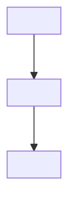

# PRD Template

**Output path**: `docs/design/<feature>-prd.md`

**Rooted in**: Amazon's Working Backwards process, Jobs-to-be-Done framework,
MoSCoW prioritization, and modern lightweight PRD practices (1-3 pages, outcome-
focused, iteratively refined).

## Template

````markdown
# <Feature Name> PRD

**Status**: Draft **Created**: YYYY-MM-DD **Author**: <Team/Author> **Last
Updated**: YYYY-MM-DD

## Problem Hypothesis

<!-- Lead with the problem, not the solution. This is the single most important
     section — spend 40-60% of your thinking here. -->

We believe **[user segment]** struggles with **[problem]** because **[root
cause]**. If we **[intervention]**, we expect **[measurable outcome]**.

## System Context

<!-- Show how this feature relates to existing components. -->



## Goals and Success Metrics

<!-- Every goal must have a measurable metric. Not "improve UX" but "reduce
     time-to-first-action from 45s to under 15s." -->

### Primary Goals

1. **<Goal>**: <Description>
   - **Metric**: <How you measure success, with target threshold>

### Secondary Goals

2. **<Goal>**: <Description>
   - **Metric**: <Measurement>

## Non-Goals

<!-- Explicit anti-goals prevent scope creep. State what you are deliberately
     choosing not to optimize for, and why. -->

- **<Non-goal>** — <Why it's out of scope for this iteration>

## User Stories

<!-- Use Jobs-to-be-Done format for richer context than traditional user
     stories. JTBD captures the situation, not just the role. -->

### US1: <Story Title>

> When **[situation]**, I want to **[motivation]**, so I can **[outcome]**.

**Acceptance Criteria** (MoSCoW-tagged):

- **Must**: <Criterion>
- **Must**: <Criterion>
- **Should**: <Criterion>
- **Could**: <Criterion>

### US2: <Story Title>

...

## Requirements

### Functional Requirements

<!-- Tag each requirement with MoSCoW priority so engineering knows the
     cut-line when time runs short. -->

#### FR1: <Requirement Name> `[Must]`

- **FR1.1**: <Specific requirement>
- **FR1.2**: <Specific requirement>

**Example**:

(code snippet or interaction showing the expected behavior)

#### FR2: <Requirement Name> `[Should]`

...

### Non-Functional Requirements

#### NFR1: <Category (Performance, Security, Accessibility, etc.)>

- <Requirement with concrete threshold, e.g., "p95 latency < 200ms">

## Alternatives Considered

<!-- Document what you explored and rejected. This builds confidence in the
     chosen approach and prevents future re-investigation. -->

### <Alternative Name>

**Why not**: <Reason for rejection>

## Open Questions

<!-- Known unknowns that must be resolved. Assign an owner and deadline. -->

| Question   | Owner  | Due    | Resolution                 |
| ---------- | ------ | ------ | -------------------------- |
| <Question> | <Name> | <Date> | <Pending/Resolved: answer> |

## Success Criteria

### How We'll Know This Worked

<!-- Separate from metrics above — this covers instrumentation and evaluation.
     What events to track, what dashboards to build, when to evaluate. -->

- <What to measure and how>
- <When to evaluate (e.g., "2 weeks post-launch")>

### Functional Verification

(Queries, code, or test commands that verify the feature works)

## Rollout Plan

<!-- Required for anything that changes existing behavior. -->

- **Feature flag**: <Flag name and strategy>
- **Phased rollout**: <Stages and criteria to advance>
- **Rollback criteria**: <What triggers a rollback>

## Dependencies

### Internal Dependencies

- <Existing module or feature this depends on>

### External Dependencies

- <Library, service, or API this depends on>

## Related Documents

- <Links to related PRDs, ADRs, technical docs>

## Decision Log

<!-- Track what changed and why, so settled questions stay settled. -->

| Date       | Decision           | Rationale | Decided By |
| ---------- | ------------------ | --------- | ---------- |
| YYYY-MM-DD | <What was decided> | <Why>     | <Who>      |

---

**Last Updated**: YYYY-MM-DD
````

## Guidelines

- **Problem-first**: Spend most of your thinking on the Problem Hypothesis. If
  you cannot articulate the problem crisply, you are not ready to write
  requirements
- **JTBD over personas**: Use "When [situation], I want to [motivation], so I
  can [outcome]" — it captures context of use, not just a role
- **MoSCoW-tag requirements**: Every functional requirement gets a Must/Should/
  Could/Won't tag so engineering knows the cut-line
- **Concrete thresholds**: Not "the system should be fast" but "p95 latency
  under 200ms." Vague criteria cause scope creep
- **Alternatives are required**: Document at least one rejected approach. This
  prevents re-litigation and shows you explored the solution space
- **Open questions have owners**: Unknown unknowns are the biggest risk — make
  them visible and assigned
- **System context diagram**: Always include a mermaid flowchart showing how the
  feature connects to existing components
- **Living document**: The PRD starts as a hypothesis and is refined through
  discovery. Update the Decision Log as things change
- **Keep it to 1-3 pages of content**: If it is longer, decompose the feature.
  Link to detailed design docs rather than inlining them
- **Edge cases matter**: Address error states, empty states, permissions, and
  degraded-mode behavior. The happy path is 20% of the work
