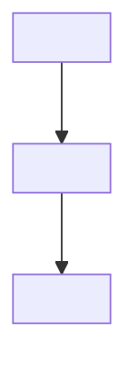

# RFC Template

**Output path**: `docs/design/<feature>-rfc.md`

**Informed by**: Phil Calcado's structured RFC process, Hashicorp/Uber/Stripe
RFC practices, NABC (Need-Approach-Benefits-Competition) framework, Pragmatic
Engineer's coverage of RFC processes across companies.

An RFC (Request for Comments) is a written proposal that seeks feedback on a
significant technical decision **before** implementation begins. It is the
collaborative design phase — the step between "we have a PRD" and "we have an
ADR."

## When to Write an RFC vs. Just an ADR

Write an RFC when:

- The change affects other teams and needs buy-in
- There are multiple viable approaches with non-obvious trade-offs
- The decision is costly to reverse
- You need to build consensus before committing

Skip the RFC (go straight to ADR) when:

- The decision is team-scoped and low-controversy
- There is a clear best approach
- Speed matters more than broad alignment
- You are recording a past decision

~20% of decisions warrant an RFC. ~80% only need an ADR.

## Template

````markdown
# RFC: <Proposal Title>

**Status**: <Draft | Collecting Feedback | Accepted | Rejected | Abandoned>
**Author**: <Name> **Created**: YYYY-MM-DD **Feedback deadline**: YYYY-MM-DD
**Stakeholders**:

| Name   | Role   | Reviewed? | Concerns? |
| ------ | ------ | --------- | --------- |
| <Name> | <Role> | [ ]       |           |

## TL;DR

<!-- 2-3 sentences. What are you proposing and why? A reader who stops here
     should understand the core proposal. -->

<Concise summary of the proposal.>

## Need / Problem Statement

<!-- What problem are we solving? Why now? Include evidence — metrics, user
     feedback, incident data. Not "we should have X" but "users are experiencing
     Y because of Z." -->

<Problem description with supporting evidence.>

## Approach / Proposed Solution

<!-- How you propose to solve it. Include enough technical detail for reviewers
     to evaluate, but not a full implementation spec. -->

### Overview

<High-level description of the approach.>

### Architecture



### Key Design Decisions

<Explain the non-obvious choices in your proposal.>

### API / Interface Changes

<What interfaces change? New endpoints, modified schemas, etc.>

### Data Model Changes

<Schema migrations, new tables/columns, data format changes.>

## Benefits

<!-- Quantified advantages over the status quo and alternatives. -->

1. <Benefit with measurable outcome>
2. <Benefit>

## Alternatives Considered

<!-- Required. At least two alternatives with real analysis.
     This is how reviewers evaluate whether you explored the space. -->

### Alternative 1: <Name>

<Description>

**Pros**: <benefits> **Cons**: <drawbacks> **Why not**: <Reason for rejection>

### Alternative 2: <Name>

<Description>

**Pros**: <benefits> **Cons**: <drawbacks> **Why not**: <Reason for rejection>

### Do Nothing

<!-- Always consider this option explicitly. -->

<What happens if we don't act? Is the status quo acceptable?>

## Risks and Drawbacks

<!-- Honest assessment of what could go wrong. -->

- **<Risk>**: <Impact and mitigation>

## Rollout Strategy

<!-- How you plan to ship this safely. -->

- **Feature flag**: <Strategy>
- **Phased rollout**: <Stages>
- **Rollback plan**: <How to undo>
- **Monitoring**: <What to watch>

## Cross-Cutting Concerns

<!-- Mandatory: address each of these explicitly, even if "N/A." -->

- **Security**: <Impact and mitigations>
- **Performance**: <Expected impact, benchmarks>
- **Observability**: <Logging, metrics, alerting changes>
- **Backwards compatibility**: <Breaking changes?>

## Open Questions

<!-- Unresolved issues you want feedback on. -->

1. <Question — specifically what input you need from reviewers>
2. <Question>

## References

- [PRD](../design/<feature>-prd.md)
- <Links to related RFCs, ADRs, external resources>

---

**Last Updated**: YYYY-MM-DD
````

## RFC Lifecycle

```
Draft → Collecting Feedback → [Accepted | Rejected | Abandoned]
```

- **Draft**: Author developing the proposal before seeking feedback
- **Collecting Feedback**: Published with an explicit deadline (1-2 weeks).
  Reviewers leave comments.
- **Accepted**: Feedback period complete, author proceeds with implementation.
  Produce ADR(s) from the accepted RFC.
- **Rejected**: Proposal declined with documented reasoning
- **Abandoned**: Author chose not to pursue

## Guidelines

### Multi-Perspective Authoring (REQUIRED)

An RFC is a collaborative artifact, not a solo document. When generating an RFC,
**always use multiple agents representing different perspectives** to draft,
challenge, and refine the proposal. This prevents blind spots, produces stronger
alternatives, and surfaces concerns that a single author would miss.

**Required perspectives** (launch as parallel agents, then synthesize):

| Perspective                    | Focus                                              | What they challenge                               |
| ------------------------------ | -------------------------------------------------- | ------------------------------------------------- |
| **Architect**                  | System design, scalability, component boundaries   | Over-engineering, coupling, missing edge cases    |
| **Operator / SRE**             | Observability, failure modes, operational burden   | "How do I debug this at 3 AM?", rollback gaps     |
| **End-user advocate**          | UX impact, migration pain, backwards compatibility | Complexity leaking to users, breaking changes     |
| **Security**                   | Attack surface, data handling, access control      | Assumptions about trust boundaries                |
| **Skeptic / Devil's advocate** | Alternative approaches, "do nothing" viability     | Confirmation bias, sunk cost, hype-driven choices |

**Process:**

1. **Draft phase**: One agent (or the user) writes the initial RFC draft
2. **Review phase**: Launch agents for each perspective in parallel. Each agent
   reads the draft and produces:
   - Concerns and objections (with severity: blocking / major / minor)
   - Questions the draft doesn't answer
   - Suggested improvements to their focus area
3. **Synthesis phase**: Incorporate feedback — update the proposal, strengthen
   alternatives, address concerns inline, and add unresolved issues to Open
   Questions
4. **The final RFC should show evidence of multi-perspective review** — the
   Cross-Cutting Concerns section, Risks section, and Alternatives section
   should reflect input from all perspectives, not just the author's viewpoint

**Why this matters**: The whole point of an RFC is to get diverse input before
committing. A single-perspective RFC is just a design doc with a fancy name. The
value comes from tension between perspectives — the architect wants elegance,
the operator wants simplicity, the security reviewer wants constraints. The RFC
resolves those tensions explicitly.

### Process

- **Feedback is NOT approval**: Authors maintain accountability. The RFC process
  collects input; it does not require consensus on every detail. If there are no
  strong objections after the deadline, the RFC proceeds.
- **Explicit deadline**: Every RFC must have a feedback deadline. Without one,
  RFCs linger forever. 1-2 weeks is typical.
- **Stakeholder checklist**: List impacted stakeholders at the top with
  checkboxes. This makes it visible who has and hasn't reviewed.
- **Produce ADRs from accepted RFCs**: An accepted RFC should produce one or
  more ADRs that capture the resulting decisions as permanent records.

### Content

- **Problem before solution**: Spend at least as much space on the need as on
  the approach. If you cannot articulate the problem crisply, you are not ready
  to propose a solution.
- **Alternatives are mandatory**: At least two real alternatives (not straw
  men). Always include "do nothing." This shows you explored the solution space.
- **Cross-cutting concerns are mandatory**: Security, performance,
  observability, and backwards compatibility must each be addressed explicitly,
  even if the answer is "no impact."
- **Quantify benefits**: Not "faster" but "reduces p95 latency from 800ms to
  200ms." Vague benefits invite vague objections.

### Anti-Patterns

- **RFC spam**: Overwhelming volume causes disengagement. Reserve RFCs for
  decisions that genuinely need broad input.
- **Design by committee**: Confusing feedback collection with approval authority
  leads to paralysis.
- **Using RFCs for cover**: Writing docs defensively to avoid accountability
  rather than to improve decisions.
- **Dummy alternatives**: Creating non-viable straw-man options to make the
  preferred choice look good. Alternatives must be genuinely considered.
- **Scope creep into implementation**: RFCs focus on "what and why" not "how to
  implement step by step."
