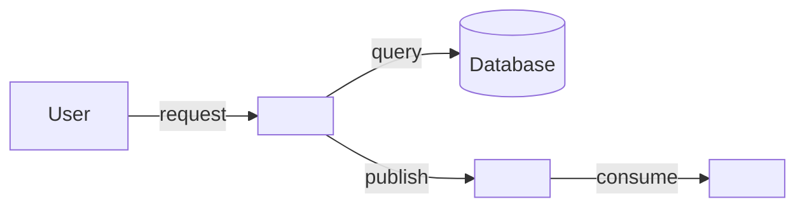

# Runbook Template

**Output path**: `docs/runbooks/<feature>.md`

**Informed by**: SRE practices from Google, PagerDuty operational documentation,
Atlassian DevOps runbook patterns, SkeltonThatcher run-book-template.

A runbook provides step-by-step instructions for operating, troubleshooting, and
maintaining a feature in production. The audience is the on-call engineer at 3
AM — someone who didn't build the feature and needs to fix it now.

## Template

````markdown
# <Feature Name> — Runbook

**Owner**: <Team or person> **Last verified**: YYYY-MM-DD **On-call
escalation**: <Contact or channel>

## Overview

<!-- One paragraph: what this feature does, why it matters, and what can go
     wrong. An on-call engineer should understand the blast radius in 30
     seconds. -->

<What this feature does and why it matters to the business.>

## Architecture Quick Reference

<!-- Minimal diagram showing the feature's components and dependencies.
     Enough to understand "what talks to what." -->



### Key Components

| Component  | Location       | Health Check       | Logs                 |
| ---------- | -------------- | ------------------ | -------------------- |
| <Service>  | <URL/host>     | <Health endpoint>  | <Log location/query> |
| <Database> | <Host/cluster> | <Connection check> | <Log location>       |
| <Worker>   | <Host/pod>     | <Status check>     | <Log location>       |

## Monitoring and Alerts

### Key Metrics

| Metric        | Normal Range | Warning     | Critical    | Dashboard |
| ------------- | ------------ | ----------- | ----------- | --------- |
| <Metric name> | <Range>      | <Threshold> | <Threshold> | <Link>    |

### Alerts

| Alert Name | Meaning             | Severity   | Runbook Section            |
| ---------- | ------------------- | ---------- | -------------------------- |
| <Alert>    | <What triggered it> | <P1/P2/P3> | [Link to section below](#) |

## Common Operations

### <Operation Name> (e.g., "Restart the worker")

**When to do this**: <Trigger condition>

**Pre-checks**:

- [ ] <Verify condition before proceeding>

**Steps**:

1. <Step with exact command>
2. <Step>
3. <Step>

**Verification**:

```bash
# Confirm the operation succeeded
<verification command>
```

**Rollback**: <How to undo if something goes wrong>

### <Operation Name>

...

## Troubleshooting

<!-- Organized by symptom. The on-call engineer searches for what they see,
     not what the system did internally. -->

### <Symptom: exact error message or observable behavior>

**Severity**: <P1/P2/P3> **Likely cause**: <Most common root cause>

**Immediate mitigation**:

1. <Step — focus on stopping the bleeding first>
2. <Step>

**Root cause investigation**:

```bash
# Diagnostic commands
<command to gather more information>
```

**Resolution**:

1. <Step to fix the underlying issue>
2. <Step>

**Verification**:

```bash
# Confirm the issue is resolved
<verification command>
```

### <Symptom>

...

## Disaster Recovery

### <Failure scenario> (e.g., "Database is down")

**Impact**: <What users experience> **RTO**: <Recovery Time Objective — how fast
we need to recover>

**Steps**:

1. <Step>
2. <Step>

### <Failure scenario>

...

## Maintenance Procedures

### <Procedure> (e.g., "Database migration", "Cache flush")

**Frequency**: <How often, or "as needed"> **Maintenance window**: <Required?
When?>

**Steps**:

1. <Step>
2. <Step>

## Escalation

| Level | Contact         | When to escalate           |
| ----- | --------------- | -------------------------- |
| L1    | <On-call>       | First responder            |
| L2    | <Team lead>     | If unresolved after 30 min |
| L3    | <Domain expert> | If root cause is unclear   |

## Dependencies

| Dependency   | Impact if unavailable | Fallback                      |
| ------------ | --------------------- | ----------------------------- |
| <Service/DB> | <What breaks>         | <Degraded mode or workaround> |

## Related Documents

- [Technical Deep-Dive](../technical/<feature>.md)
- [Test Strategy](../testing/<feature>.md)
- [Implementation Plan](../plans/<feature>-plan.md)

---

**Last verified**: YYYY-MM-DD
````

## Guidelines

### Audience

- **Write for the 3 AM on-call engineer**: Someone who didn't build this
  feature, is tired, and needs to fix it now. No jargon they wouldn't know. No
  assumed context.
- **Commands are copy-pasteable**: Every diagnostic and fix step should include
  the exact command to run. Not "check the logs" but the specific log query.
- **Mitigation before investigation**: When something is broken, stop the
  bleeding first (restart, failover, feature flag off), THEN investigate root
  cause.

### Structure

- **Architecture quick reference**: A single diagram showing components and
  dependencies. Enough to understand "what talks to what" in 30 seconds.
- **Alerts link to runbook sections**: Every alert should reference the specific
  troubleshooting section in this runbook.
- **Troubleshooting by symptom**: Organize by what the on-call engineer
  OBSERVES, not by internal failure mode. Use exact error messages as headings.
- **Escalation path is mandatory**: Who to call and when. Clear levels.

### Operations

- **Pre-checks before every operation**: Verify the system state before making
  changes. Don't assume.
- **Verification after every operation**: How to confirm the operation
  succeeded.
- **Rollback for every operation**: How to undo if it made things worse.
- **Disaster recovery scenarios**: Cover the top 2-3 failure modes. Include RTO
  (Recovery Time Objective) for each.

### Maintenance

- **Keep it current**: A stale runbook is dangerous — worse than no runbook
  because it gives false confidence. Verify quarterly at minimum.
- **Test the runbook**: Periodically walk through procedures in staging. If a
  step doesn't work, fix the runbook.
- **Version with the code**: Runbooks belong in the repo, not a wiki. They
  should be updated in the same PR as the code changes.
