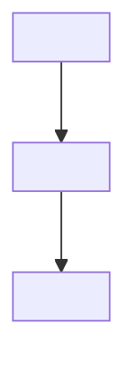
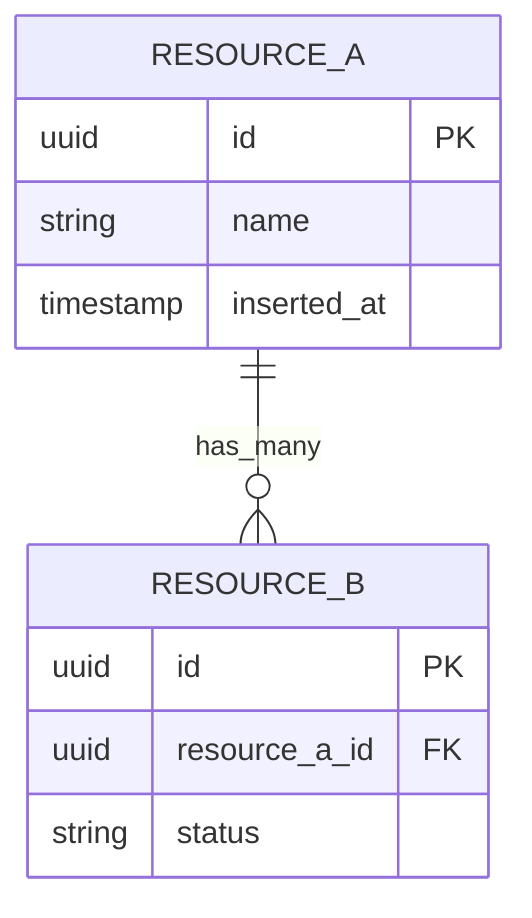
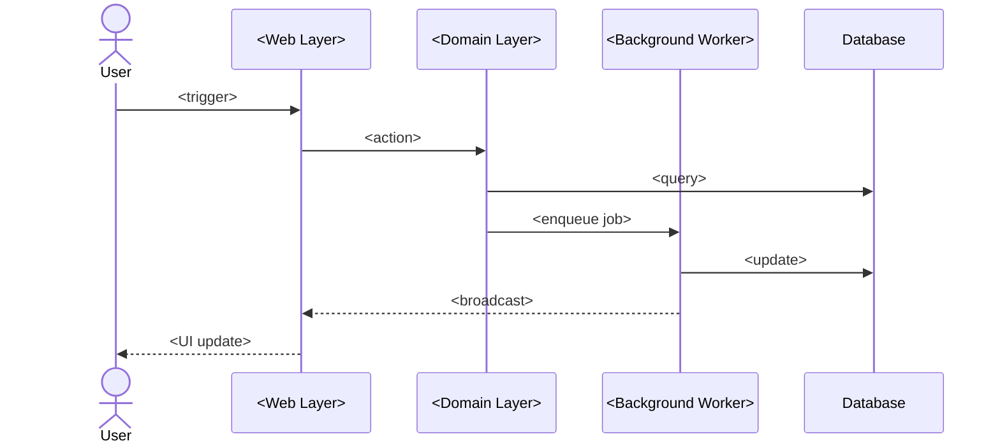

# Technical Deep-Dive Template

**Output path**: `docs/technical/<topic>.md`

**Informed by**: Diataxis framework (explanation mode), C4 model zoom levels,
arc42 template, Google technical writing guidelines, "behavior vs.
implementation" separation principle.

## Template

````markdown
# <Topic Title>

**Last verified**: YYYY-MM-DD (against version/commit <ref>) **Scope**:
<What this covers and what it explicitly does not> **Prerequisites**:
<What the reader should already understand>

## TL;DR

<!-- 3-5 sentences maximum. A reader who stops here should have the core
     mental model. This is the most valuable paragraph in the document. -->

<Concise summary of what this system/component does, why it exists, and the key
architectural insight.>

## Table of Contents

- [Context](#context)
- [Behavior](#behavior)
- [Architecture](#architecture)
- [Data Model](#data-model)
- [Key Decisions](#key-decisions)
- [Known Limitations](#known-limitations)
- [Implementation Notes](#implementation-notes)
- [Troubleshooting](#troubleshooting)
- [Related Documents](#related-documents)

## Context

<!-- Where does this fit in the larger system? C4 Level 1 — system context.
     What systems/actors interact with it? -->



<Prose explanation of where this fits and why it exists.>

## Behavior

<!-- What does this system/component do, described from the OUTSIDE.
     Contracts, guarantees, edge cases. This section should survive refactors.
     Lead with behavior; implementation is supporting evidence below. -->

### <Behavior Area 1>

<What the system does in this area. Use present tense: "When X happens, the
system does Y.">

### <Behavior Area 2>

...

### Guarantees and Invariants

- <What the system guarantees — e.g., "at-least-once delivery">
- <What invariants are maintained — e.g., "balance never goes negative">

### Edge Cases

- <Edge case>: <How it's handled>

## Architecture

<!-- C4 Level 2-3 — container/component view. Show internal structure.
     Declare the zoom level explicitly. -->

```mermaid
flowchart TD
    subgraph <Domain Name>
        ModuleA[<Module Name>] -->|<action>| ModuleB[<Module Name>]
        ModuleB -->|<event>| ModuleC[<Module Name>]
    end
    External[<External System>] -->|<interaction>| ModuleA
```

<Prose explanation — what each component does, why it exists, and how they
connect.>

## Data Model

<!-- Include an ER diagram if the topic involves database tables or resources
     with relationships. Omit this section if not applicable. -->



<Description of key attributes, relationships, and constraints.>

## Key Decisions

<!-- Why is it this way and not another way? Link to ADRs if they exist.
     Rejected alternatives are high-value — they prevent re-investigation. -->

### <Decision>

**Chosen**: <What was chosen> **Why**: <Rationale> **Rejected alternative**:
<What was considered and why not> **ADR**:
[link](../design/YYYYMMDD-<decision>-adr.md) (if exists)

## Known Limitations and Technical Debt

<!-- What is known to be imperfect and why it was accepted.
     Honesty here saves future developers from discovering these the hard way. -->

- **<Limitation>**: <Why it exists and when it might be addressed>

## Implementation Notes

<!-- The "how" details. Code-level specifics. This section is intentionally
     AFTER behavior and architecture — readers should be able to skip it
     and still understand the system. -->

### <Module/Subsystem>

<Explanation of how this part works. Include key code paths.>

<!-- Link to tests as living proof. The test is verified on every CI run;
     prose is not. -->

**Verified by**: `test/<path>/<test_file>`

### <Module/Subsystem>

...

## Request/Data Flow

<!-- Show the sequence of interactions for a typical operation. -->



<Prose walkthrough — what happens at each step and why.>

## Configuration

| Option  | Description        | Default     | Location        |
| ------- | ------------------ | ----------- | --------------- |
| `<key>` | <What it controls> | `<default>` | `config/<file>` |

## Troubleshooting

<!-- Lead with the symptom (what the user SEES), not the cause.
     Users search for what they observe. -->

### <Symptom the user sees>

**Cause**: <Why it happens>

**Fix**:

```
# Verification / fix command
```

## Related Documents

- [<PRD Name>](../design/<feature>-prd.md)
- [<ADR Name>](../design/YYYYMMDD-<decision>-adr.md)
- [<Plan Name>](../plans/<feature>-plan.md)

---

**Last verified**: YYYY-MM-DD
````

## Guidelines

### Document Structure (Diataxis)

- **This is an explanation document**: It exists so someone can understand _why_
  things are the way they are. When you cross into reference material (API
  signatures, config options), signal the shift clearly or link to separate
  docs.
- **TL;DR is mandatory**: 3-5 sentences at the top. A reader who stops here
  should have the core mental model.
- **Scope and freshness upfront**: State what the doc covers, what it doesn't,
  and when it was last verified. A reader can instantly assess relevance and
  staleness.

### Behavior vs. Implementation

- **Lead with behavior, follow with implementation**: "What it does from the
  outside" is stable and survives refactors. "How the code achieves it" is
  fragile. If a reader only skims headings and first paragraphs, they should get
  a complete behavioral picture.
- **Separate the "what" from the "how"**: Behavior section describes contracts,
  guarantees, and edge cases. Implementation Notes section has code-level
  specifics. A reader should be able to skip Implementation Notes entirely.

### Architecture Documentation (C4 Model)

- **Declare zoom level**: Context (L1), Container (L2), Component (L3), or Code
  (L4). This sets reader expectations.
- **At least one diagram**: Every technical doc MUST have at least one mermaid
  diagram. Include a state diagram if stateful, ER diagram if data model.
- **Use actual names**: Real module/resource names in diagrams, not generic
  labels.

### Key Decisions

- **Document rejected alternatives**: This is high-value content — it prevents
  future developers from re-investigating the same options.
- **Link to ADRs**: If a formal ADR exists, link to it. If not, capture the
  decision context inline.

### Living Documentation

- **Link to tests as proof**: Instead of prose describing an edge case, link to
  the test that exercises it. Tests are verified on CI; prose is not.
- **Date and version**: "Last verified: 2026-01. Covers: session lifecycle in
  v0.4.x." Not just "Last Updated."
- **Co-locate with code**: Deep-dives belong near the code they describe, not in
  a separate wiki.

### Anti-Patterns

- **The novel**: 5000-word wall of text nobody reads. Break into scannable
  sections with the TL;DR at top.
- **The changelog disguised as docs**: Describes how things evolved, not how
  they are. Write for the present state; link to ADRs/git for history.
- **Missing "why"**: Says what the code does (the reader can see that) but not
  why. Every section should answer "why does this exist?" before "how does it
  work?"
- **Completeness trap**: Documenting every function exhaustively. Document the
  20% that causes 80% of confusion.
